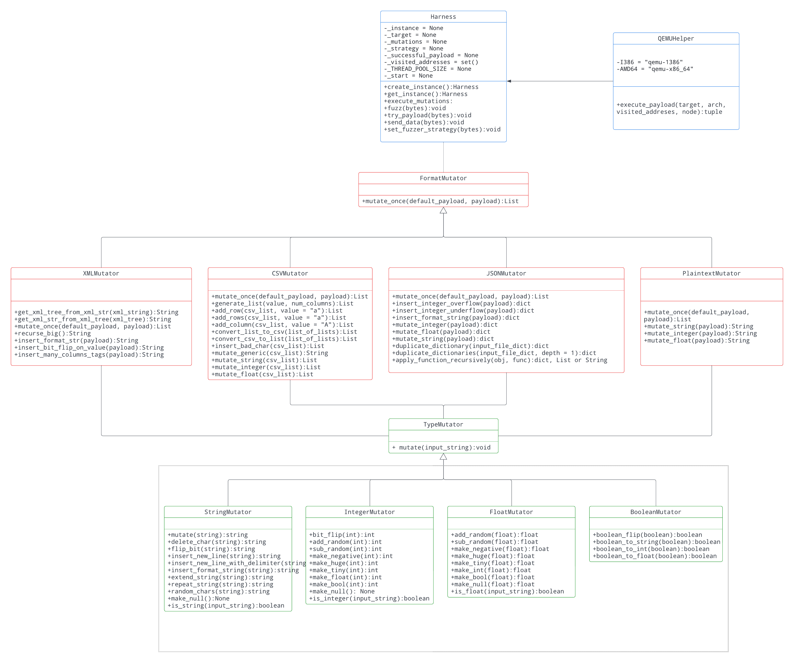

# Fully Sick Fuzzer
# COMP6447 Major Project
# by Cameron Huang, Cyrus Wilkie, Hashimi Chau, and Jayden Leung

## Project Specification Checklist
- [] 10 marks - General Fuzzer
  - [x] Finding all vulnerabilities in the 11 provided binaries. (10 - All except JPEG)
  - [x] Writing test vulnerable binaries to test your fuzzer
- [] 10 marks - Fuzzer Functionality
  - [x] Mutation Strategies
    - [x] Basic (bit flips, byte flips, known ints)
    - [x] Intermediate (repeated parts, keyword extraction, arithmetic)
    - [x] Advanced (coverage based mutations)
  - [] Understanding and manipulation of file formats (Manipulating file headers, field names, data structures, etc)
    - [x] Basic (JSON, CSV, XML)
    - [] Intermediate (JPEG, ELF)
    - [] Advanced (PDF)
- [] 10 marks - Harness Functionality
  - [x] Detecting the type of crash (2 marks)
  - [x] Detecting Code Coverage (2 marks)
  - [] Avoiding overheads (2 marks)
    - [] Not creating files
    - [] In memory resetting (Not calling execve)
  - [x] Useful logging / statistics collection and display (2 marks)
  - [x] Detecting Hangs / Infinite loops (2 marks)
    - [x] Detecting infinite loop (code coverage) vs slow running program (timeout approach)
- [] Bonus (6 marks) - Something awesome
  - [x] Something cool your fuzzer does (consult course staff to see if your thing is valid).
  - [] Finding novel / non-trivial bugs in Public Software / OSS Software with your fuzzer.

## Design & Functionality - How the fuzzer works
### UML Diagram

###
Our program begins by using the `from_file` module from the `magic` library to detect the file type of the input, it then loads the appropriate mutator for that file type. 
The current file types that our fuzzer supports are:
- Plaintext
- CSV
- JSON
- XML
The file type mutator engages in fuzzing strategies specific to the relevant file format and then calls specific data type mutators to deal with the fuzzing of data types stored within that file format.

The fuzzing strategies for the currently supported file types are:
- JSON
    - tests for buffer overflows by duplicating the input JSON dictionary and passing that to the binary
    - tests for format string vulnerabilities by randomly inserting format string characters into the different values in the JSON dictionary 
    - tests for general logic issues by randomly inserting arbitrary characters into the values of the JSON dictionary
    - tests for integer overflow and underflow by adding and subtracting random amounts from JSON dictionary values that are numbers
    - performs similar testing for floats
    - converts between floats and integers to find logic errors
- CSV
    - adds rows and/or columns to the CSV payload until the binary crashes from a buffer overflow
    - adds format specifiers, like `%s`, as part of the CSV payload until the binary leaks an address, thereby displaying a format string vulnerability in the binary
    - attempts to find any logic errors through:
        - randomly overwriting arbitrary characters into the CSV payload, including the commas 
        - flipping the bits of the payload, including the bits that represent a comma
        - deleting arbitrary characters in the payload
    - adds and subtracts random values from integer values in the CSV payload until an integer underflow or overflow occurs
- XML
    - gives the binary an input consisting of thousands of nested tags in an attempt to cause a buffer overflow
    - flips the bits that represent the XML characters in an attempt to cause the program to crash
    - inserts dozens of un-nested tags in an attempt to cause a buffer overflow
- Plaintext
    - tests for buffer overflows by randomly extending string outputs
    - tests for format string vulnerabilities by randomly inserting format string characters into strings
    - tests for general logic issues by randomly inserting random characters into strings
    - tests for integer overflow and underflow by adding and subtracting random values from inputted integer data
    - performs similar testing for floats
    - converts between floats and integers to find logic errors

### Type Mutations & Strategies
Our program currently supports four different data type mutations, they are listed below, alongside the crashes they are intended to elicit:
- Boolean
    - negate boolean (General logic errors)
    - convert boolean to string (Data type errors)
    - convert boolean to int (Data type errors)
    - convert boolean to float (Data type errors)
- Float
    - byte flips (General logic errors)
    - bit flips (General logic errors)
    - add or subtract a random integer (Float overflow/underflow)
    - make negative (Float underflow/General logic)
    - make huge - known floats (Float overflow)
    - make tiny - known floats (Float underflow)
    - convert float to int (Data type errors)
    - convert float to bool (Data type errors)
    - convert float to null (Data type errors)
- Integer
    - byte flips (General logic errors)
    - bit flips (General logic errors)
    - add or subtract a random integer (Integer overflow/underflow)
    - make negative (Integer underflow)
    - make huge - known ints (Integer overflow)
    - make tiny - known ints (Integer underflow)
    - convert int to float (Data type errors)
    - convert int to bool (Data type errors)
    - convert int to null (Data type errors)
- String
    - delete random char (General logic errors)
    - insert random char (General logic errors)
    - flip random bit (General logic errors)
    - insert new line in random location (General logic errors)
    - insert new line in random location with delimiter (General logic errors)
    - insert format string in random location (Format string vulnerabilities)
    - extend string (Buffer overflow)
    - extend string by repeating itself (Buffer overflow)

Our boolean, float and integer mutations ensure that the program being tested properly validates these data types by converting input to other arbitrary data types.
These mutations also test for basic logic issues and the validation of values by setting these data types to extremely large values or positive/negative values where a negative/positive value is expected.

Our string mutations test for similar issues, but also test for issues unique to string inputs, including buffer overflows and format string vulnerabilities. 
It does this by extending the input string to large, arbitrary lengths and also randomly adding in newlines and format string characters.

### What kinds of bugs can your fuzzer find?
Currently, our fuzzer should be capable of finding:
- Buffer overflows
- Integer overflow and underflow
- Format string vulnerabilities
- Basic data validation issues (mismatched data types, invalid values, etc)

### Fuzzing Heuristic
- Each mutation created by our mutation strategies is ranked. This ranking is based on the generation of the mutation (i.e. how many mutations has this mutation undergone from its original payload) and whether it caused a new code branch. Mutations with the highest ranking are prioritised and are executed first
- By incorporating code coverage, it allows our fuzzer to take priority over mutations that cause new code paths. Basically, our fuzzer starts by performing a breadth-first fuzz then when a new code path is found it will depth-first fuzz that

## Something Awesome 
### QEMU (Code coverage)
- We have decided to run our binaries on QEMU instead of using our native 64-bit Intel architecture machines
    - we are using QEMU in an operating mode called **user-mode emulation**
    - what QEMU does, in our case, is translate the `x86_32` assembly instructions of the binary file into `x86_64` assembly instructions
    - while this can be done natively, QEMU allows us to analyse these 32-bit binaries at runtime
    - this gives us a lot of info about these binaries, even if we don't have the source code
- One way we have used an advantageous feature of QEMU is to calculate code coverage, a particularly useful heuristic in fuzzing
    - to do this, we leveraged QEMU's ability to output trace files
    - From these, we could see which addresses were called and thus determine if a new code branch has occurred
    - This transition was largely beneficial however it did come at a cost, it caused our fuzzer to run slower when sending large inputs
    - To account for this, we prioritised smaller payloads first before sending larger ones

### Multi-Threading
- Initially, our fuzzer ran using a single thread
- While this made debugging easier, it did take longer to fuzz each binary
- Thus, we made our fuzzer use multiple threads to decrease runtime
- Threads are spawned based on the number of tasks that need to be completed in the priority queue, which holds a queue of payloads to give to the binary
- Surprisingly we were able to gain at least a 4x speed improvement compared with a single-threaded process (given a fuzzer running on at least 6 threads)
- However, there is some overhead in spawning, managing and deleting multiple threads
  - For example, if a particular thread is using a strategy that specifically gives the binary a very large input, this thread may take very long to execute
  - The thread executor must eventually wait for this thread to finish before this thread is free to be used for another task
  - Thus, while a multithreaded fuzzer does provide an advantage over a single-threaded fuzzer in most cases, it can be just as slow (or slower) in certain instances

### What improvements have been made since the midpoint check-in?
From the list of potential improvements outlined in our check in write up, we were able to implement the following:
- Increasing functionality 
    - Fuzzing 64 bit binaries
    - Fuzzing additional file formats such as plaintext and XML
    - Fuzzing more files of all formats
    - Progress-logging and generation of results log upon crash detection
    - Adding extra type mutators such as list and dictionary mutators
- Increasing speed
  - Optimising our fuzzer by improving our algorithm's runtime and utilising multithreading for concurrently executing our payloads on the binaries
- Priority queue heuristic
  - We integrated a genetic algorithm into our heuristic
  - Mutations that trigger a new code path have a higher priority compared with one that doesn't
  - In order to do this, we implemented a way to measure code coverage using QEMU

### What improvements can be made to your fuzzer in future?
The improvements we want to make include:
- A lot!
- Fuzzing additional file types such as JPEG, PDF and ELF
- Detection of additional errors and vulnerabilities as the fuzzer in the current state only detects issues that cause segmentation faults
  - These may include the detection of vulnerabilities that do not cause crashes such as use after free and double free vulnerabilities
- Adding additional mutation strategies for list and dictionary mutators
- The coverage detection mechanism currently is very rudimentary and has not been optimised for efficiency. One improvement is to incorporate some of the optimisations that AFL uses in for QEMU so that it can run faster.
- Another future improvement is to code it in a faster language such as c++ since python is fairly slow. This will substantially decrease the time it takes for our program to fuzz especially when executing QEMU.
